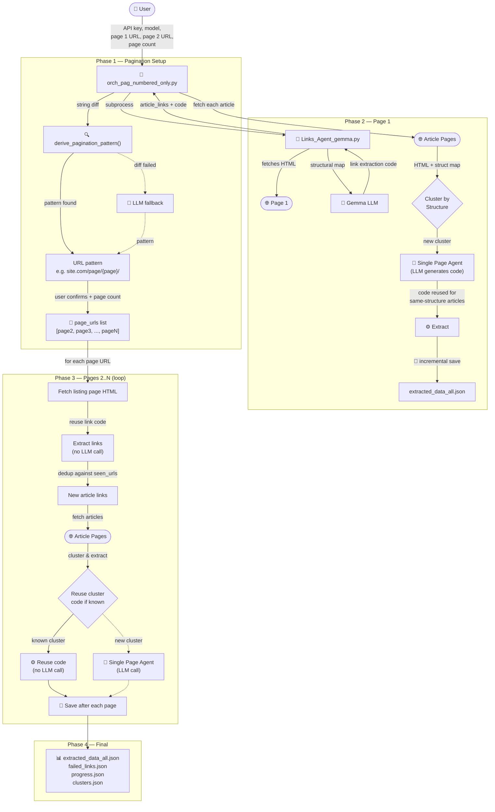

# AI Web Scraping Agent

An AI Agent that automates web scraping by using an LLM to generate extraction code.

## What It Does
- Takes a URL that you need to scrape + description of the data you want to extract
- Automatically generates scraping code using an LLM
- Outputs the scraped data in JSON format

## Agents

### 1. Links Agent (`Links_Agent_gemma.py`)
Extracts article links from a **listing page** (e.g., a news index).
- Fetches the page and builds a structural map
- Uses Gemma (via Google AI API) with few-shot prompting to generate link-extraction code
- Returns a list of `{url, title}` objects

### 2. Single Page Agent (`Agent_for_single_page_gemma.py`)
Extracts structured data from a **single article page** (e.g., title, date, author, body text).
- Fetches the page and builds a structural map
- The user specifies what fields to extract
- Uses Gemma with few-shot prompting to generate the code to extract the fields that the user requested.
- Returns a dict with the requested fields

Both agents support:
- **Interactive mode**: run directly, pick a model from the list, enter URL, review results
- **CLI mode**: called by the orchestrator via `--url`, `--api-key`, `--requirements`, `--model` flags

### 3. Orchestrators

There are two orchestrator variants:

#### `orch.py` — Batch Orchestrator (single page)
Ties both agents together to scrape **many articles from a single listing page** in one run.

1. **Get article links** — calls `Links_Agent_gemma.py` on a listing page URL, or loads an existing JSON file.
2. **Fetch structural maps** — for every article link.
3. **Cluster articles by structure** — groups articles sharing the same HTML template.
4. **Extract from representative** — for each cluster, calls `Agent_for_single_page_gemma.py` to generate extraction code.
5. **Apply code to the rest** — reuses the working code across all articles in the cluster.
6. **Save results** — `extracted_data_all.json` + `failed_links.json` in a timestamped run directory.

#### `orch_pag_numbered_only.py` — Page-by-Page Pagination Orchestrator
Extends the batch orchestrator to handle **multi-page listing sites** with numbered pagination. Processes articles **page by page** with incremental saves after every page.

##### How pagination works:

The user provides the **page 1 URL** and the **page 2 URL**. The orchestrator derives the URL pattern automatically by diffing the two URLs (string diff first, LLM fallback if the diff fails). The user confirms the pattern and specifies how many pages to scrape.

**Examples of supported URL patterns:**
| Page 1 | Page 2 | Derived pattern |
|--------|--------|-----------------|
| `https://site.com/news` | `https://site.com/news?page=2` | `https://site.com/news?page={page}` |
| `https://site.com/articles/65/1` | `https://site.com/articles/65/2` | `https://site.com/articles/65/{page}` |
| `https://site.com/posts/` | `https://site.com/posts/page/2/` | `https://site.com/posts/page/{page}/` |
| `https://site.com/index?id=10` | `https://site.com/index?id=10&page=2` | `https://site.com/index?id=10&page={page}` |

##### Page-by-page flow:

1. **Phase 1 — Pagination setup** (no LLM needed): User provides page 1 + page 2 URLs → pattern is derived via string diff (or LLM fallback) → user confirms → user enters page count.

2. **Phase 2 — Page 1**: Calls Links Agent to extract article links and generate link-extraction code. Then fetches all article pages, clusters them by structure, and generates extraction code per cluster. Saves incrementally.

3. **Phase 3 — Pages 2..N**: For each subsequent page, fetches the listing page HTML, reuses the link-extraction code from page 1, deduplicates against seen URLs, fetches new articles, clusters them (reusing existing cluster code when possible), and saves after every page.

4. **Phase 4 — Final save**: Writes `extracted_data_all.json`, `failed_links.json`, `progress.json`, and `clusters.json`.

##### LLM call budget:
- **0–1** for pagination pattern (only if string diff fails)
- **1** for link extraction code (Links Agent on page 1)
- **N** for article extraction (one per unique structure cluster — page 1 establishes most)
- Later pages reuse all generated code; new LLM calls only happen for genuinely novel article structures

#### System Diagram (Page-by-Page Orchestrator)



#### How clustering works:

The orchestrator uses **exact structural signature hashing**:

- For each article's structural map, it walks the tag tree (up to depth **3**) and builds a string like:
  ```
  div.post-content(article.(h1.title()|div.meta(span.author()|time.date()))|div.body(p.()|p.()))
  ```
- This string is MD5-hashed, and articles with the same hash go into the same cluster.
- This means two articles are in the same cluster only if their top-3-level HTML skeleton (tag names + CSS classes) is **identical**.
- For same-site scraping this works well — articles from the same template always match. If a site has multiple templates, they'll form separate clusters and each gets its own extraction code.

## How the LLM Integration Works

### The agent follows this flow:

1. **Fetch & Simplify**: The code fetches the entire HTML content of the page that needs to be scraped, then creates a **structural map** of that HTML content.
   
   > **What is a structural map?** A simplified, nested representation of the HTML structure showing only relevant tags (div, section, article, etc.) with their classes and IDs. This makes it easier for the LLM to understand the page layout without processing the entire raw HTML.

2. **Generate Code**: The structural map + the user's description of the data that needs to be scraped is fed to the LLM (using Gemma via Google AI API), and the LLM generates Python code to scrape the page. The prompts use Gemma's `<start_of_turn>` / `<end_of_turn>` control tokens and include few-shot examples.

3. **Execute & Show Sample**: An executor runs the generated code in a restricted sandbox and shows a sample of the output to the user. If the code produces an error, the code and context get sent to the LLM again so it can generate new code.

4. **User Validation**: The user decides if the sample is good enough. If not, the user's objection gets sent to the LLM along with the previous context so it can generate improved code.

## Work Plan

### Set up the manual scraping process:
- [x] Code for scraping
- [x] Pinpoint the data that needs to be fed to the code manually (ex: CSS selectors)

### Automate the process:
- [x] Replace human input with LLM (ex: use LLM to find the CSS selectors)
- [x] Scale to scrape multiple pages (orchestrator + clustering)
- [x] Add numbered pagination (user provides page 1 + page 2 URLs, pattern auto-derived)

### Ship into a simple UI:
- [ ] Create Streamlit interface

## Current Status
The page-by-page orchestrator (`orch_pag_numbered_only.py`) can scrape multi-page listing sites end-to-end — derive pagination URLs from two examples, extract links page by page, cluster by template, generate code once per cluster, reuse it across all pages, and save incrementally after every page.

Tested on those domains:
- ✅ youm7 -success from start to end-:
  - https://www.youm7.com/Section/%D8%A3%D8%AE%D8%A8%D8%A7%D8%B1-%D8%B9%D8%A7%D8%AC%D9%84%D8%A9/65/1
- ✅ pchrgaza -success but needs more work-
  - https://pchrgaza.org/ar/category/genocide-on-gaza-ar/testimonies-from-the-war-ar/
- ✅ gazastory — pagination pattern derived successfully (JS-driven site)
  - https://www.gazastory.com/testimonies/region/regionAll
- ✅ almasryalyoum — pagination pattern derived successfully (query-param pagination)
  - https://www.almasryalyoum.com/news/index?typeid=1&sectionid=10
- ❌ palestine-studies failed extraction from this page, cloudflare related error -failed-
  - https://www.palestine-studies.org/ar/blogs/explorer?f%5B0%5D=field_blog_series%3A19943
- ✅ https://euromedmonitor.org/ar/category/26/%D8%A7%D9%84%D9%86%D8%B2%D8%A7%D8%B9%D8%A7%D8%AA-%D8%A7%D9%84%D9%85%D8%B3%D9%84%D8%AD%D8%A9
- ❌ Links extraction failed:Failed to fetch page structure cloudflare
  - https://acpss.ahram.org.eg/OuterWriter/28/%D9%85%D9%82%D8%A7%D9%84%D8%A7%D8%AA/0.aspx
  - https://acpss.ahram.org.eg/OuterWriter/28/%D9%85%D9%82%D8%A7%D9%84%D8%A7%D8%AA/30.aspx
- ❌ Mana معني
  a Cloudflare/bot challenge marker
  - https://mana.net/category/articles/page/2/
  - https://mana.net/category/articles/page/2/
- ✅ the Guardian 3 pages 
  - https://www.theguardian.com/world/gaza
  - https://www.theguardian.com/world/gaza?page=2
- ❌ UNDP 
  a Cloudflare/bot challenge marker
  - https://stories.undp.org/categories/africa
- btselem
  No cloudflare issue
  - first page https://www.btselem.org/ota/100/all
  - second page https://www.btselem.org/ota/100/all?page=1

To be tested on:

- Load more button pag:
  - https://www.arageek.com/tech
  - https://www.alarabiya.net/views
  - 


- Infinite scroll:
  - https://arabic.cnn.com/tag/gaza_strip
  - https://www.aljadeedmagazine.com/%D9%85%D9%82%D8%A7%D9%84%D8%A7%D8%AA
  - https://aawsat.com/%D8%A7%D9%84%D8%B1%D8%A3%D9%8A

- Numbered:
  - https://mana.net/category/articles/
  - 