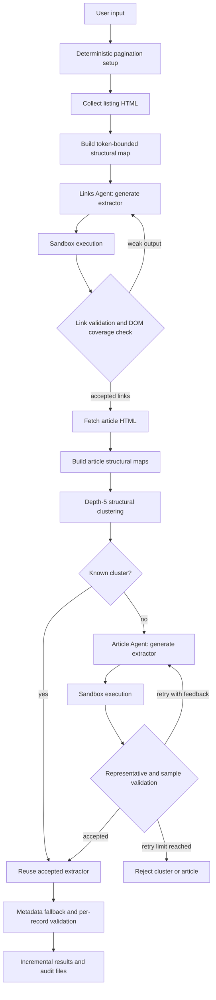

# AI Web Scraping Agent

An AI Agent that automates web scraping by generating, testing, repairing, and reusing Python extraction code for heterogeneous listing and article pages.

The agent uses Gemma through the Google AI API to interpret unfamiliar HTML structures and create site-specific extractors. It combines two specialized AI agents with deterministic tools for retrieval, pagination, clustering, validation, recovery, persistence, and evaluation.

## What It Does

Given a listing-page URL and a description of the article fields to extract, the AI Agent can:

- collect article links from a single page, numbered pages, infinite scroll, or a load-more interface;
- retrieve article HTML through requests and browser fallbacks;
- build token-bounded structural maps instead of sending full HTML to the model;
- group structurally similar articles and generate one extractor per template;
- execute generated code in a restricted subprocess;
- validate outputs and regenerate failed extractors with targeted feedback;
- reuse accepted extraction code across matching pages and later listing pages;
- save results, failures, generated code, progress, clusters, and audit records incrementally;
- freeze HTML snapshots and support human annotation for reproducible evaluation.

## Agent Architecture

The AI Web Scraping Agent is coordinated by a deterministic orchestrator and contains two specialized AI agents. Each agent follows a generate-execute-validate-repair loop: it examines a structural representation of a page, generates extraction code, runs that code, and revises it when execution or validation fails. The orchestrator supplies tools and guardrails, manages state, and reuses accepted extractors at scale.

| Agent or component | Responsibility |
|---|---|
| **Links Agent** (`Links_Agent_gemma_cloudflare.py`) | Interprets listing-page structure, generates link-extraction code, evaluates returned links, and repairs weak extractors. |
| **Article Agent** (`Agent_for_single_page_gemma.py`) | Interprets representative article structure and generates or repairs field-extraction code using execution and validation feedback. |
| **Agent Orchestrator** (`orch_interactive_pagination.py`) | Coordinates the agents and tools for pagination, retrieval, filtering, clustering, validation, code reuse, retries, checkpoints, and reporting. |
| `utils.py` | Shared fetching, challenge detection, structural-map budgeting, sandbox, token accounting, and reporting utilities. |
| `orch_pag_snapshot.py` / `snapshot_collector.py` | Run extraction while freezing listing and article HTML for reproducible evaluation. |
| `labeling_app.py` / `aggregate.py` | Annotate saved pages and rebuild evaluation tables from append-only JSONL labels. |
| `test_script.py` / `test_script_snapshot.py` | Run repeatable multi-domain campaigns and append Markdown result tables. |



## Extraction Workflow

### 1. Pagination and listing collection

The main orchestrator supports four modes:

1. **Single page** - process one listing URL.
2. **Numbered pagination** - infer a URL pattern from page 1 and page 2 using deterministic string differencing, with an LLM fallback when necessary.
3. **Infinite scroll** - scroll until content stops growing or the configured round limit is reached.
4. **Load more** - click a supplied selector or detect a visible load-more control, including Arabic labels.

For numbered pagination, the first page establishes the link extractor and initial article-template registry. Later pages reuse both. Offset-style patterns are supported, and pagination stops when severe page overlap indicates that the inferred sequence is no longer advancing.

### 2. Structural maps and prompt budgeting

Each agent receives a simplified tree containing relevant tag names, classes, IDs, and selected metadata rather than unrestricted raw HTML. Article maps preserve useful metadata such as `datetime`, `itemprop`, `property`, `name`, and bounded `content` values.

Before generation, the map is fitted to a model-specific input budget. Its depth is reduced only when needed, and the selected depth and estimated input size are recorded for auditing.

### 3. Link extractor generation and recovery

The Links Agent reasons over the listing-page structural map, generates an `extract_data(html_content)` function, and executes it in a restricted subprocess. Returned URLs are normalized, deduplicated, restricted to eligible same-site document links, and screened for navigation, archive, pagination, and static-asset URLs.

The generated set is compared with a conservative deterministic DOM baseline. When the baseline contains at least three likely articles and generated recall falls below 70%, the system retries with corrective feedback or repairs the result from DOM evidence. Page-level counts, duplicate ratios, overlap warnings, and generated recall are saved in `link_coverage.json`.

### 4. Article retrieval

Article pages use a requests-first strategy for speed and fall back to browser retrieval when HTTP retrieval fails or returns unusable content. Listing and agent-level retrieval can additionally try headless browser, headed browser, and plain HTTP paths as appropriate.

Challenge-page detection rejects Cloudflare, DataDome, CAPTCHA, access-denied, and related bot-challenge responses instead of treating them as article HTML. Retrieval method counts are included in each run report.

### 5. Structural clustering

Article pages are grouped by a deterministic structural signature:

- the signature walks the structural map to depth **5**;
- each node contributes its tag, CSS classes, and child signature;
- duplicate sibling patterns are collapsed;
- the resulting string is hashed to a 12-character MD5 cluster key.

Collapsing repeated siblings makes the signature **count-insensitive**. Two pages can remain in one cluster when they differ only in the number of paragraphs or list items, while different content structures, such as paragraph-based and list-based bodies, remain separable. This replaces the earlier depth-3 exact-skeleton method.

### 6. Extractor generation, validation, and reuse

For each unseen cluster, the Article Agent reasons over a representative page and generates an extractor for the requested fields. The agentic repair loop then:

1. runs the generated code against the exact saved HTML used to build the structural map;
2. checks requested keys and rejects missing or `N/A` required fields;
3. validates up to four additional pages from the same cluster;
4. feeds execution and validation failures back to the model;
5. retries up to three article-extractor attempts;
6. stores accepted code in the cluster registry and reuses it for the remaining pages.

Generated values take precedence, but missing requested fields can be recovered conservatively from schema.org Article JSON-LD, Open Graph metadata, standard metadata, and `<time datetime>` elements. Reused outputs are still validated per record; a failed record is rejected rather than silently propagated.

## Guardrails and Failure Handling

- Generated code is parsed and executed with import, file, network, and process restrictions plus time limits.
- Fetching rejects known challenge and non-HTML responses.
- Link output is validated against URL and DOM evidence.
- Article output is checked for requested fields before cluster-wide reuse.
- Retries and model calls are bounded.
- Non-interactive runs reject exhausted critical failures; interactive runs can return control to the user for noncritical decisions.
- Progress and results are written incrementally so completed pages survive later failures.

These checks establish operational acceptability. They do **not** prove that extracted text is semantically identical to human-authored gold data.

## Outputs

Each orchestrator run is written under `orch_runs/run_<timestamp>/`. Depending on the run path, artifacts include:

| Artifact | Purpose |
|---|---|
| `extracted_data_all.json` | Validator-accepted article records. |
| `failed_links.json` | Article URLs rejected during retrieval, generation, execution, or validation. |
| `progress.json` | Incremental pagination and cluster state. |
| `clusters.json` | Structural cluster IDs and generated extractor files. |
| `links_dropped.json` | Links removed by deterministic filtering. |
| `link_coverage.json` | Listing-page counts, overlap flags, and DOM-baseline coverage evidence. |
| Generated `.py` files | Reusable LLM-generated extraction functions. |

Aggregate run summaries are appended to `results.md`. Multi-domain campaign results are appended to `testing_multiple_domains.md`.

## Current Results

The latest consolidated campaign uses the most recent result for each domain at or after **2026-08-02 01:50:13**. It contains 48 completed domains from 49 selected domains; `arabic.euronews.com` had no completed post-cutoff row and is excluded.

### Operational results

| Metric | Result |
|---|---:|
| Completed domains | 48 |
| Clean runs | 29/48 (60.42%) |
| Runs with warnings | 16/48 (33.33%) |
| Listing-page failures | 3/48 (6.25%) |
| Listing pages retrieved | 91/94 (96.81%) |
| Article attempts | 2,388 |
| Validator-accepted articles | 2,052/2,388 (85.93%) |
| Rejected articles | 336/2,388 (14.07%) |
| LLM subprocess calls | 257 |
| Structural clusters | 134 |
| Accepted articles per reported LLM call | 7.98 |
| Accepted articles per cluster | 15.31 |
| Aggregate runtime | 7.50 hours |
| Throughput | 4.56 accepted articles/minute |

Of the 48 completed domains, 40 (83.33%) achieved at least 70% validator-accepted article coverage. Restricting the denominator to the 45 domains where article processing was attempted, 40 (88.89%) achieved that threshold.

| Domain-level article coverage | Domains | Share of completed domains |
|---|---:|---:|
| 100% | 29 | 60.42% |
| 90% to <100% | 8 | 16.67% |
| 70% to <90% | 3 | 6.25% |
| >0% to <70% | 2 | 4.17% |
| 0% | 3 | 6.25% |
| Listing-page failure, no article denominator | 3 | 6.25% |

Article coverage is defined as:

$$
\mathrm{coverage}=\frac{\mathrm{validator\text{-}accepted\ articles}}{\mathrm{accepted\ articles}+\mathrm{rejected\ articles}}
$$

This is an **operational validation metric**, not semantic precision or extraction correctness. Semantic precision, recall, F1, and exact-match results require comparison with the frozen human-annotated gold dataset.

### Retrieval and reuse

- 2,150 article retrievals used requests and 236 used browser fallback among 2,386 classified attempts: 90.11% requests and 9.89% browser.
- Two article attempts did not have a classified fetch method in the aggregate logs.
- The campaign used 23 numbered-pagination, 15 load-more, and 10 infinite-scroll domain runs.

The current report records Gemma usage as `$0.0000` under the tested free-tier assumption. This is provisional run-level reporting, not account-wide billing verification.

## Reproducible Evaluation

Operational validation and semantic extraction quality are evaluated separately.

- `orch_pag_snapshot.py` runs extraction while freezing listing and article HTML.
- `snapshot_collector.py` writes HTML, generated link code, and metadata containing URLs, titles, page numbers, byte sizes, and SHA-1 hashes.
- `labeling_app.py` records gold title, date, author, body, per-field status, overall decisions, labeler identity, notes, and system predictions.
- `aggregate.py` rebuilds derived tables from append-only per-labeler JSONL files.
- `evaluate.py` provides token-level comparison utilities.
- `swde_benchmark.py` provides page-level attribute precision, recall, and F1 on prepared SWDE data.

Validator acceptance, non-`N/A` completeness, and semantic correctness are intentionally reported as different quantities.

## Installation

Python and a Playwright-supported browser are required.

```powershell
python -m pip install -r requirements.txt
python -m playwright install chromium
```

The Google AI API key can be entered interactively when the orchestrator starts. Do not commit API keys or `.env` files.

## Usage

Run the main interactive workflow:

```powershell
python orch_interactive_pagination.py
```

The program asks for:

- a Gemini API key and model;
- the listing URL;
- requested article fields;
- the pagination mode and its mode-specific inputs.

Run a multi-domain campaign:

```powershell
python test_script.py
```

Run the snapshot-producing campaign used for reproducible evaluation:

```powershell
python test_script_snapshot.py
```

Start the labeling interface after snapshots have been collected:

```powershell
python labeling_app.py
```

## Cost Model

For a successful domain run, model usage is approximately:

- **0-1 calls** to infer a numbered-pagination pattern when deterministic differencing fails;
- **1 or more attempts** to generate and validate the listing-page link extractor;
- **1 or more attempts per unseen article cluster** to generate a validated article extractor;
- **0 calls for ordinary pages in known clusters**, because accepted code is reused.

Retries increase actual generation attempts. The historical `LLM calls` campaign column counts agent subprocess invocations and may therefore undercount generation attempts made inside an agent retry loop.

## Known Limitations

- Bot protection, authentication, robots policies, and inaccessible content can prevent retrieval; the system does not attempt to bypass access controls.
- DOM-baseline link coverage is a conservative diagnostic, not gold-standard link recall.
- Structural hashing is deterministic but may split cosmetic variants or merge pages whose depth-5 skeletons match despite deeper semantic differences.
- Deterministic validation detects missing fields and execution failures but cannot establish semantic correctness.
- Metadata fallbacks improve completeness but can return summaries or page-level metadata rather than the desired full article text.
- Small clusters and highly unique templates reduce code-reuse efficiency.
- Current cost reporting assumes Gemma free-tier use and does not track account-wide quota or billing state.

## Project Status

Implemented:

- listing-link and article-extractor synthesis;
- single-page, numbered, infinite-scroll, and load-more workflows;
- offset-aware numbered pagination and overlap stopping;
- requests/browser retrieval fallbacks and challenge detection;
- depth-5 count-insensitive structural clustering;
- token-budgeted structural maps;
- DOM-baseline link recovery and coverage audits;
- representative and same-cluster article validation;
- agentic generate-execute-validate-repair loops with bounded retries;
- JSON-LD and metadata field recovery;
- incremental run persistence and aggregate reporting;
- HTML snapshots, annotation storage, and evaluation utilities.

In progress:

- completing and independently verifying the frozen gold dataset;
- blinding annotation before prediction reveal;
- reporting semantic field-level precision, recall, F1, and exact match;
- improving retrieval diagnostics for the remaining listing-page failures;
- packaging the workflow in a simpler user interface.
