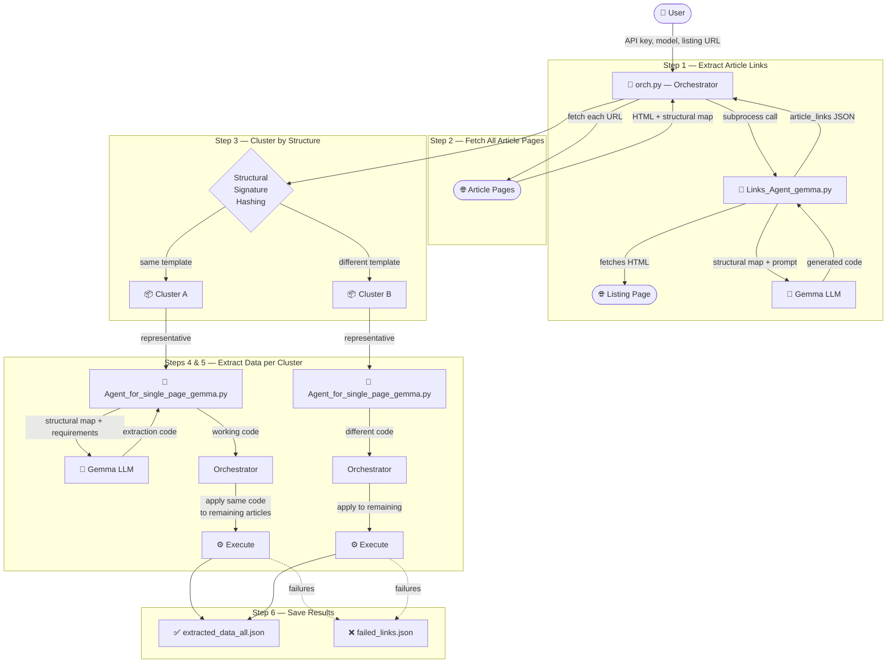

# AI Web Scraping Agent

An AI Agent that automates web scraping by using an LLM to generate extraction code.

## What It Does
- Takes a URL that you need to scrape + description of the data you want to extract
- Automatically generates scraping code using an LLM
- Outputs the scraped data in JSON format

## Agents

### 1. Links Agent (`Links_Agent_gemma.py`)
Extracts article links from a **listing page** (e.g., a news index).
- Fetches the page and builds a structural map
- Uses Gemma (via Google AI API) with few-shot prompting to generate link-extraction code
- Returns a list of `{url, title}` objects

### 2. Single Page Agent (`Agent_for_single_page_gemma.py`)
Extracts structured data from a **single article page** (e.g., title, date, author, body text).
- Fetches the page and builds a structural map
- The user specifies what fields to extract
- Uses Gemma with few-shot prompting to generate the code to extract the fields that the user requested.
- Returns a dict with the requested fields

Both agents support:
- **Interactive mode**: run directly, pick a model from the list, enter URL, review results
- **CLI mode**: called by the orchestrator via `--url`, `--api-key`, `--requirements`, `--model` flags

### 3. Orchestrator (`orch.py`)
Ties both agents together to scrape **many articles** from a site in a single run.

#### How the orchestrator works:

1. **Get article links** — either by calling `Links_Agent_gemma.py` on a listing page URL, or by loading an existing JSON file with pre-extracted links.

2. **Fetch structural maps** — for every article link, it fetches the HTML and generates a structural map (reuses `fetch_page_structure` from the single page agent).

3. **Cluster articles by structure** — groups articles that share the same HTML template so that one piece of extraction code can be reused across the whole group.

4. **Extract from representative** — for each cluster, picks one article and calls `Agent_for_single_page_gemma.py` (via subprocess) to generate and test extraction code on it.

5. **Apply code to the rest** — takes the working code from the representative and runs it on all remaining articles in the cluster. If it works → save. If not → log to failures.

6. **Save results** — writes `extracted_data_all.json` (successes) and `failed_links.json` (failures) into a timestamped run directory.

#### System Diagram



#### How clustering works:

The orchestrator uses **exact structural signature hashing**:

- For each article's structural map, it walks the tag tree (up to depth **3**) and builds a string like:
  ```
  div.post-content(article.(h1.title()|div.meta(span.author()|time.date()))|div.body(p.()|p.()))
  ```
- This string is MD5-hashed, and articles with the same hash go into the same cluster.
- This means two articles are in the same cluster only if their top-3-level HTML skeleton (tag names + CSS classes) is **identical**.
- For same-site scraping this works well — articles from the same template always match. If a site has multiple templates, they'll form separate clusters and each gets its own extraction code.

## How the LLM Integration Works

### The agent follows this flow:

1. **Fetch & Simplify**: The code fetches the entire HTML content of the page that needs to be scraped, then creates a **structural map** of that HTML content.
   
   > **What is a structural map?** A simplified, nested representation of the HTML structure showing only relevant tags (div, section, article, etc.) with their classes and IDs. This makes it easier for the LLM to understand the page layout without processing the entire raw HTML.

2. **Generate Code**: The structural map + the user's description of the data that needs to be scraped is fed to the LLM (using Gemma via Google AI API), and the LLM generates Python code to scrape the page. The prompts use Gemma's `<start_of_turn>` / `<end_of_turn>` control tokens and include few-shot examples.

3. **Execute & Show Sample**: An executor runs the generated code in a restricted sandbox and shows a sample of the output to the user. If the code produces an error, the code and context get sent to the LLM again so it can generate new code.

4. **User Validation**: The user decides if the sample is good enough. If not, the user's objection gets sent to the LLM along with the previous context so it can generate improved code.

## Work Plan

### Set up the manual scraping process:
- [x] Code for scraping
- [x] Pinpoint the data that needs to be fed to the code manually (ex: CSS selectors)

### Automate the process:
- [x] Replace human input with LLM (ex: use LLM to find the CSS selectors)
- [x] Scale to scrape multiple pages (orchestrator + clustering)

### Ship into a simple UI:
- [ ] Create Streamlit interface

## Current Status
The orchestrator can scrape an entire listing page worth of articles in a single run — extract links, cluster by template, generate code once per cluster, and apply it across all articles.
Tested on those domains:
    - ✅ youm7 -success from start to end-:
        - https://www.youm7.com/Section/%D8%A3%D8%AE%D8%A8%D8%A7%D8%B1-%D8%B9%D8%A7%D8%AC%D9%84%D8%A9/65/1 
    - ✅ pchrgaza -success but needs more work-
        - https://pchrgaza.org/ar/category/genocide-on-gaza-ar/testimonies-from-the-war-ar/
    - ❌ palestine-studies failed extraction from this page, clodflare related error -failed-
        -  https://www.palestine-studies.org/ar/blogs/explorer?f%5B0%5D=field_blog_series%3A19943
